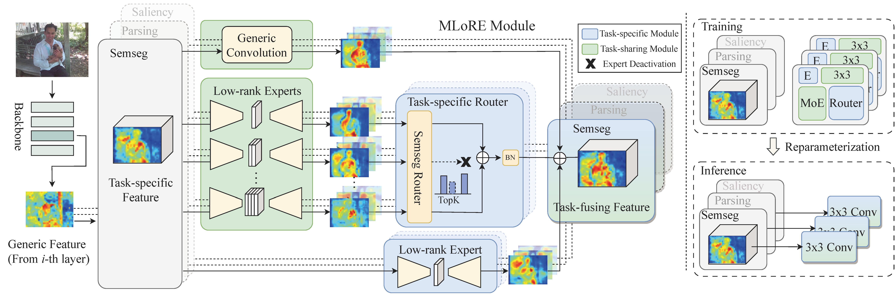

#  [CVPR2024] Multi-Task Dense Prediction via Mixture of Low-Rank Experts

<p align="center">
  
</p>

##  Abstract
We provide the code for MLoRE, a new multi-task framework for dense prediction. Our code is implemented on PASCAL-Context and NYUD-v2 based on ViT.

- MLoRE builds a novel decoder module based on MoE(Mixture of Experts) that can capture the global relationship across all tasks.
- To further reduce the computation cost and parameters, MLoRE introduces low-rank linear experts, which can enlarge the capacity of feature representations without increasing the model size too much.
- The design of MLoRE achieves a new state-of-the-art (SOTA) performance with superior efficiency on PASCAL-Context and NYUD-v2. 

Please check the [paper](https://arxiv.org/abs/2403.17749) for more details.
<p align="center">
  
  <br>
    <em>Framework overview of the proposed MLoRE for multi-task scene understanding.</em>
</p>

# Installation

## 1. Environment
You can use the following command to prepare your environment.
```bash
conda create -n mlore python=3.7
conda activate mlore
pip install tqdm Pillow==9.5 easydict pyyaml imageio scikit-image tensorboard
pip install opencv-python==4.7.0.72 setuptools==59.5.0

pip install torch==1.10.0+cu111 torchvision==0.11.0+cu111 torchaudio==0.10.0 -f https://download.pytorch.org/whl/torch_stable.html
pip install timm==0.5.4 einops==0.4.1
```

## 2. Data
You can download the PASCAL-Context and NYUD-v2 from ATRC's repository in [PASCALContext.tar.gz](https://hkustconnect-my.sharepoint.com/:u:/g/personal/hyeae_connect_ust_hk/ER57KyZdEdxPtgMCai7ioV0BXCmAhYzwFftCwkTiMmuM7w?e=2Ex4ab),
[NYUDv2.tar.gz](https://hkustconnect-my.sharepoint.com/:u:/g/personal/hyeae_connect_ust_hk/EZ-2tWIDYSFKk7SCcHRimskBhgecungms4WFa_L-255GrQ?e=6jAt4c):
### PASCAL-Context
```bash
tar xfvz PASCALContext.tar.gz
```
### NYUD-v2
```bash
tar xfvz NYUDv2.tar.gz
```

**Attention**: you need to specify the root directory of your own datasets as ```db_root``` variable in ```configs/mypath.py```.


## 3. Training
You can train your own model by using the following commands.
PASCAL-Context:
```bash
bash run_MLoRE_pascal.sh
```

NYUD-v2
```bash
bash run_MLoRE_nyud.sh
```

If you want to train your model based on ViT-Base, you can modify the ```--config_exp``` in ```.sh``` file.

You can also modify the output directory in ```./configs```.

## 4. Evaluate the model
The training script itself includes evaluation. 
For inferring with pre-trained models, you can use the following commands.
PASCAL-Context:
```bash
bash infer_MLoRE_pascal.sh
```

NYUD-v2
```bash
bash infer_MLoRE_nyud.sh
```

For the evaluation of boundary, you can use the evaluation tools in this [repo](https://github.com/prismformore/Boundary-Detection-Evaluation-Tools) following TaskPrompter.

# Pre-trained models
We provide the pretrained classification models on PASCAL-Context and NYUD-v2.

### Download pre-trained models
|Version | Dataset | Download | Depth (RMSE) | Segmentation (mIoU) |  Human parsing (mIoU) | Saliency (maxF) | Normals (mErr) | Boundary (odsF) | 
|:-:|:-:|:-:|:-:|:-:|:-:|:-:|:-:|:-:|
| MLoRE (ViT-L)| PASCAL-Context | [Google](https://drive.google.com/file/d/1s35pDbFctDl1eLqMFFycEuBxMlA2Vtoa/view?usp=sharing) | - |81.41 | 70.52 |84.90 | 13.51 | 75.42 |
| MLoRE (ViT-B)| PASCAL-Context | [Google](https://drive.google.com/file/d/1Hu8bHdL-2JukEHh8269E5OUYmbiGciZU/view?usp=sharing) | - | 79.26 | 67.82 |85.31 | 13.65 | 74.69 |
| MLoRE (ViT-L) | NYUD-v2 | [Google](https://drive.google.com/file/d/1BOaw5zaZGg6MXl6wH13a306WoAYEXxzX/view?usp=sharing) | 0.5076 | 55.96 | - | - | 18.33 | 78.43 |

### Infer with the pre-trained models
To evaluate the pre-trained models, you can change the ```--trained_model MODEL_PATH``` in ```infer.sh``` to load the specified model.

#  Cite
<!-- Please consider :star2: star our project to share with your community if you find this repository helpful! -->
If you find our work helpful, please cite:
BibTex:
```
@inproceedings{jiang2024mlore,
  title={Multi-Task Dense Prediction via Mixture of Low-Rank Experts},
  author={Yang, Yuqi and Jiang, Peng-Tao and Hou, Qibin and Zhang, Hao and Chen, Jinwei and Li, Bo},
  booktitle={Proceedings of the IEEE/CVF conference on computer vision and pattern recognition},
  year={2024}
}
```

# Contact
If you have any questions, please feel free to contact Me(yangyq2000 AT mail DOT nankai DOT edu DOT cn).

# Acknowledgement
This repository is built upon the nice framework provided by [TaskPrompter and InvPT](https://github.com/prismformore/Multi-Task-Transformer).

